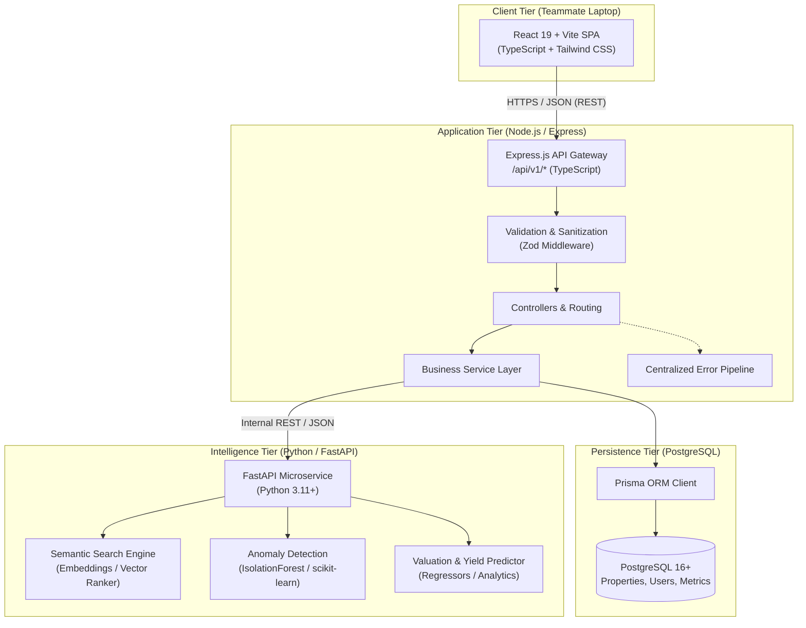
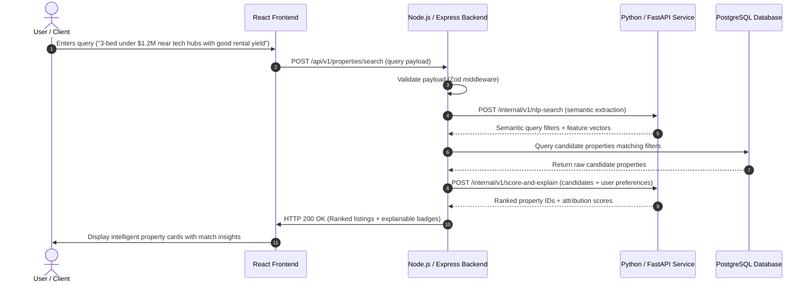

# PropWise AI — System Architecture & Design Specification

> **Platform Vision**: Intelligent Real Estate Discovery, Investment & Risk Analysis Platform  
> **Author**: Senior Backend & Systems Architect  
> **Status**: Phase 1 Foundation Approved  

---

## 1. Executive Overview

PropWise AI is an enterprise-grade platform designed to transform real estate discovery from simple keyword filtering into an intelligent, data-driven investment analysis experience. Moving far beyond traditional CRUD listing directories, PropWise AI combines modern full-stack web engineering with applied machine learning to deliver:

1. **Natural-language property discovery** (semantic intent matching).
2. **Explainable property recommendations** (transparent matching scores).
3. **Investment & rental-yield forecasting** (cash flow, cap rate, ROI analytics).
4. **Listing anomaly detection** (identifying fraudulent, mispriced, or outlier listings).
5. **Neighborhood intelligence** (walkability, crime, schools, demographic trends).
6. **Side-by-side property comparison matrices**.
7. **Personalized investor profiles and portfolio tracking**.

---

## 2. High-Level System Architecture

PropWise AI is structured as a decoupled, multi-tier distributed architecture designed for maintainability, horizontal scalability, and clear separation of concerns between web presentation, core business logic, relational persistence, and machine-learning model serving.



---

## 3. Component Responsibilities & Boundaries

### 3.1 Frontend Client (React + Vite + TypeScript + Tailwind CSS)
* **Scope**: Developed independently on a separate workstation.
* **Responsibilities**:
  * Rich user interface, interactive maps, responsive dashboards.
  * Real-time client-side filter manipulation, chart visualizations (investment curves, cap rates).
  * Consuming versioned REST APIs (`/api/v1/*`) using typed contracts.
  * State management for user sessions, search criteria, saved properties, and comparison drawers.

### 3.2 Core Backend (Node.js + Express + TypeScript)
* **Scope**: Primary orchestration hub and API boundary.
* **Responsibilities**:
  * **API Gateway & Routing**: Exposes modular, versioned REST endpoints (`/api/v1`).
  * **Input Validation & Sanitization**: Validates all headers, query parameters, URL params, and JSON payloads via Zod before hitting business logic.
  * **Business Logic & Workflow Orchestration**: Executes domain rules (investment calculators, comparison logic, user workflows).
  * **Data Access**: Interfaces with PostgreSQL via Prisma ORM for ACID transactions, pagination, and relations.
  * **AI Service Client**: Acts as an HTTP client proxying requests to the Python AI service, enforcing timeouts, fallbacks, and caching.
  * **Cross-Cutting Concerns**: Centralized error mapping, request logging, security headers (Helmet), CORS policies, and health monitoring.

### 3.3 Relational Database (PostgreSQL + Prisma ORM)
* **Scope**: Persistent system of record.
* **Responsibilities**:
  * Structured storage for listings, agent details, historical price changes, neighborhoods, users, and saved searches.
  * Strong relational integrity and indexing on geographic coordinates, pricing ranges, and timestamps.
  * Migration management using Prisma Schema-as-Code.

### 3.4 AI/ML Intelligence Service (Python + FastAPI + scikit-learn)
* **Scope**: Specialized microservice for heavy scientific computing and ML inferences.
* **Responsibilities**:
  * **Natural-Language Search**: Parsing unstructured user queries (e.g., *"quiet 3-bed craftsman near top public schools with strong rental upside"*) into semantic vector spaces.
  * **Anomaly Detection**: Training and serving Isolation Forest or autoencoder models to detect listing discrepancies (unrealistic rent, price outliers, fraudulent metadata).
  * **Valuation & Yield Modeling**: Running feature engineering pipelines and regression models to estimate fair market value and projected cap rates.
  * **Explainability Engine**: Providing feature importance attribution (e.g., SHAP values or score breakdowns) to explain *why* a property was recommended.

---

## 4. Inter-Service Communication Protocols

| Channel | Protocols | Format | Purpose |
| :--- | :--- | :--- | :--- |
| **Frontend ↔ Backend** | HTTPS (REST) | JSON | User interactions, authenticated requests, CRUD, dashboard aggregates |
| **Backend ↔ Database** | PostgreSQL TCP | Binary wire protocol | High-performance ORM queries, transactions, connection pooling |
| **Backend ↔ AI Service** | HTTP/1.1 (Internal) | JSON | Model inferences, NLP parsing, score attribution |

### 4.1 Frontend ↔ Backend Communication Contract
All responses emitted by the Express backend adhere to a standardized envelope contract:

#### Success Envelope (`ApiResponseSuccess<T>`)
```json
{
  "success": true,
  "message": "Operation completed successfully",
  "data": { ... },
  "timestamp": "2026-10-09T14:16:27.912Z"
}
```

#### Error Envelope (`ApiResponseError`)
```json
{
  "success": false,
  "message": "Validation failed",
  "error": {
    "code": "VALIDATION_ERROR",
    "details": [
      {
        "field": "budget",
        "message": "Budget must be positive"
      }
    ]
  },
  "timestamp": "2026-10-09T14:16:27.912Z"
}
```

### 4.2 Backend ↔ AI Service Interaction Flow



---

## 5. Backend Internal Architecture (Phase 1 Foundation)

The Node.js/Express backend enforces strict layered boundaries to maintain modularity and avoid tight coupling:

```
backend/
├── src/
│   ├── config/              # Validated environment configuration (Zod)
│   ├── constants/           # HTTP status codes, system constants
│   ├── controllers/         # Request handling, response orchestration
│   ├── errors/              # Domain & operational AppError hierarchy
│   ├── middleware/          # Request logging, validation, 404, error handler
│   ├── routes/              # Modular API version routing (/api/v1/*)
│   │   └── v1/              # Version 1 route endpoints
│   ├── services/            # Pure business logic and domain processing
│   ├── types/               # TypeScript interfaces and response schemas
│   ├── utils/               # Standardized API response formatters & logger
│   ├── app.ts               # Express configuration (decoupled from network listener)
│   └── server.ts            # Process lifecycle, port listener, graceful shutdown
├── tests/                   # Automated unit and integration test suite
├── tsconfig.json            # Strict TypeScript compiler options
├── vitest.config.mts        # Fast, native TypeScript test runner configuration
└── package.json             # Scripts, locked dependencies, engines
```

### Architectural Principles Enforced:
1. **Decoupled Application & Server**: `app.ts` exports the configured Express application without listening on a TCP socket, enabling deterministic, fast integration testing via Supertest without socket collisions. `server.ts` is the single entry point responsible for process lifecycle and graceful shutdown (`SIGTERM`, `SIGINT`).
2. **Fail-Fast Configuration**: Environment variables are parsed and validated with Zod at startup. If a required configuration is missing or malformed, the application terminates immediately with actionable error details before accepting traffic.
3. **Uniform Error Handling**: Custom `AppError` subclasses (`NotFoundError`, `BadRequestError`, `ValidationError`) guarantee that status codes and error codes remain predictable. The centralized error handler captures all synchronous and asynchronous errors, shielding internal stack traces in production.
4. **Declarative Request Validation**: Zod schemas validate `params`, `query`, and `body` at the middleware boundary. Controllers receive pre-validated, strongly-typed inputs.

---

## 6. Development & Deployment Roadmap

* [x] **Phase 1: Architecture & Backend Foundation**
  * Modular directory structure, TypeScript configuration, build scripts.
  * Versioned API structure (`/api/v1`), health diagnostic endpoint (`/api/v1/health`).
  * Centralized error pipeline, Zod request validator, environment loader.
  * Comprehensive automated testing and architectural documentation.
* [ ] **Phase 2: Persistence & Data Modeling (Prisma ORM + PostgreSQL)**
  * Property schema, neighborhood intelligence schema, investor preferences.
  * Database migrations, seed scripts with realistic property datasets.
* [ ] **Phase 3: Core Property Discovery APIs**
  * Filtering, sorting, geospatial queries, pagination, property detail endpoints.
* [ ] **Phase 4: AI/ML Service Foundation (Python / FastAPI)**
  * Microservice setup, scikit-learn models for anomaly detection and pricing.
  * Backend-to-AI internal HTTP client with circuit breaking.
* [ ] **Phase 5: Financial & Investment Analytics Engine**
  * Net operating income (NOI), cap rate, cash-on-cash return, mortgage calculation.
* [ ] **Phase 6: Explainable AI & Comparison Modules**
  * Recommendation transparency, side-by-side listing comparison engine.
* [ ] **Phase 7: End-to-End Integration, OpenAPI/Swagger Documentation, CI/CD**
  * OpenAPI 3.0 specification, Docker compose orchestration, GitHub Actions CI.
